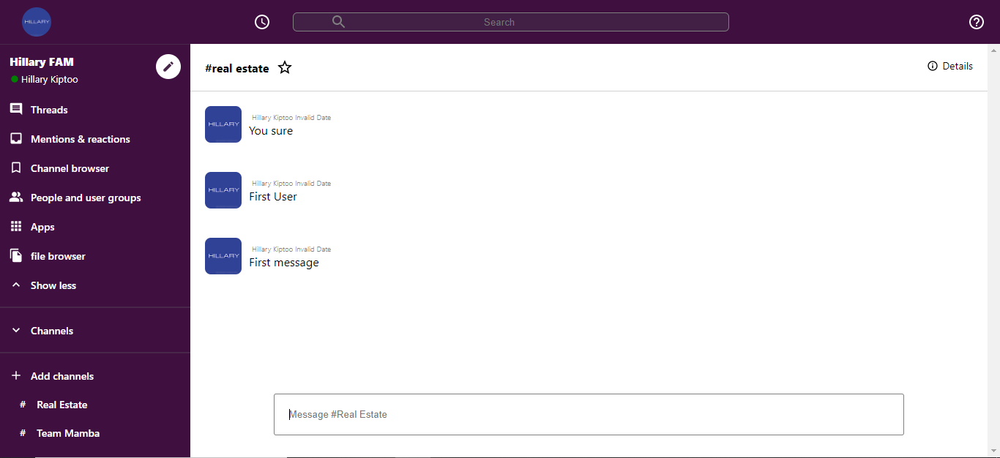

# Slack 2.0 

>  Slack 2.0 !

## Description

Slack 2.0 is a slack clone built with React, Redux, Firebase hooks, Google Auth, React hooks, styled components. This slack clone allows users to
login with existing google account using firebase hooks. Users can login create channels, send messages.

## Live version

Heres a live <a href="https://slack-20b65.web.app">link</a>

## Features

Slack 2.0 web  app has the following features
- Create channels.
- Send messages.
- Firebase auth login.

## Built with

- HTML
- Git
- CSS
- JavaScript
- Shields.io
- Webpack
- npm
- command-line tools such as git.
- React
- Styled components
- create-react-app-buildpack
- Redux
- Firebase
- React Hooks
- Firebase Hooks

## Author

Reach out!

👤 **Hillary Kiptoo**

- LinkedIn: [Hillary Kiptoo](https://www.linkedin.com/in/hillarykiptoo)
- Github: [@imhilla](https://github.com/imhilla)
- Twitter: [@hillarykiptoo](https://twitter.com/hillarykiptoo_)

## Contributing 🤝

Contributions, issues, and feature requests are welcome!

## Acknowledgments

- Thanks to Microverse for its support!

## Show your support

Give a ⭐️ if you like this project!

## License

- **[MIT license](http://opensource.org/licenses/mit-license.php)**
